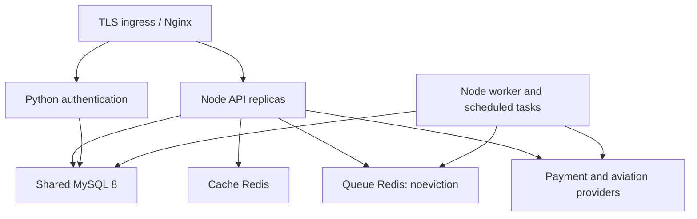

# Production topology — AIS Aviation System

Updated 2026-09-13 from the committed deployment and runtime code. This describes
software topology; it is not evidence of a live deployment or aviation approval.

| Component             | Committed authority                                         | Runtime contract                                                                                                       |
| --------------------- | ----------------------------------------------------------- | ---------------------------------------------------------------------------------------------------------------------- |
| Web/API               | `server/_core/index.ts`, `server/routers.ts`                | Node 24; authenticated tenant context; no scheduler on each API replica                                                |
| Authentication        | `auth-service/`, `AUTH_SERVICE_URL`                         | Python service using the same migrated MySQL database (`mysql+pymysql://`) and configured JWT contract                 |
| Database              | `drizzle/schema.ts`, `scripts/db/migrate.ts`                | MySQL 8, not PostgreSQL; run committed migrations once before API/auth/worker rollout                                  |
| Cache                 | `REDIS_URL`                                                 | Cache availability is not evidence that queue workers are processing                                                   |
| Queue                 | `QUEUE_REDIS_URL`                                           | Explicit production queue endpoint; `maxmemory-policy noeviction`; BullMQ and scheduled work run in `server/worker.ts` |
| Deployment            | `docker-compose.production.yml`, `k8s/base/`                | Shared database and queue across replicas; backup images and actions pinned by repository policy                       |
| External integrations | `AVIATION_SOURCE_REGISTRY` and configured provider adapters | Scoped signed sources, effective evidence, original collection/refund identity and provider acceptance                 |

Booking and flight writes use shared database transactions. `outbox` belongs to
the producing transaction. `event_inbox` stores immutable envelopes;
`event_deliveries` records each consumer independently. A published envelope or a
stored aviation event is not a ticket, dispatch, baggage-custody or airport receipt.

Recovery and assignment writers lock the operator before flight/crew state.
Booking settlement still owns the booking and its itinerary inventory. Recovery
approvals include crew, tail, maintenance and source evidence, which is checked
again at execution. Local reassignment remains separate from operator dispatch.

`operational_samples` stores HTTP response batches and worker dependency checks.
The operations screen reads these shared observations, alerts, scheduler receipts
and delivery failures. Missing/stale observations remain unknown. The older SLA
endpoints are process-local diagnostics; neither dataset establishes contractual
uptime without an external observation/availability contract. API batching can lose
the last ten seconds during an abrupt process loss; successful writes are durable
and retried batches keep their identity. Retention is 30 days.

The worker writes readiness only after database, queue and mandatory consumers
pass. Kubernetes startup probes allow initialization; readiness removes a sick
instance; liveness restarts one whose readiness remains absent/stale. The API
also evaluates operational alerts, so a stopped worker cannot suppress its own
missing-heartbeat alert. Independent external monitoring remains necessary if the
entire API/database installation is unavailable.

See [the operations runbook](operations/integration-recovery.md),
[provider acceptance requirements](operations/provider-acceptance.md), and
[domain ownership](architecture/service-ownership.json). Repository review falls
back to `@kafaat`; accountable owners and on-call assignments are explicitly
unassigned until the organization supplies accepted contacts.
