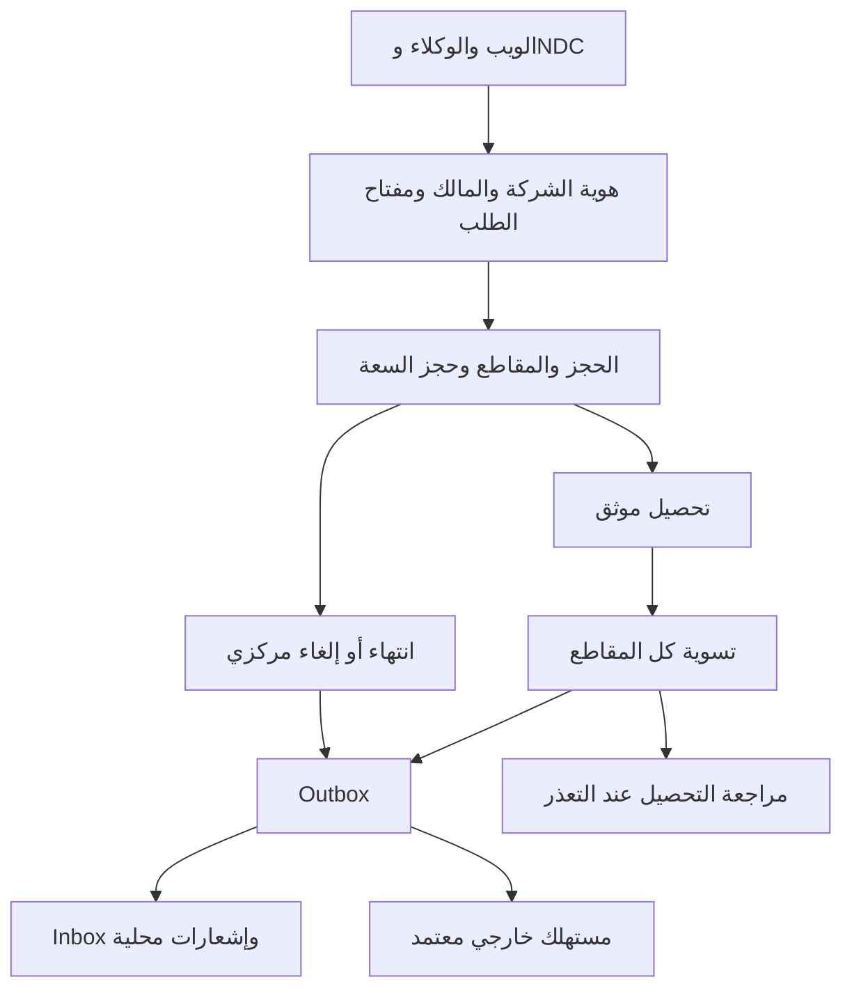

# متابعة إغلاق فجوات main

المرجع الجنائي الأصلي: `3c3c7fe`، الإصدار `1.22.2`. أُدمج PR #136 في `04fc7a2`، ثم صدرت `1.22.3` على `57e6585`. هذه المتابعة مبنية على الإصدار الأخير، وتفصل إصلاح الكود عن قبول بيئة التشغيل. لا تمثل اعتمادًا للطيران أو للأجهزة أو لمزودي الدفع.

## التغييرات والأدلة

| الفجوة | المعالجة                                                                                                         | المالك التقني ← المستهلك                                                  | ما يلزم للقبول التشغيلي                                                                                          |
| ------ | ---------------------------------------------------------------------------------------------------------------- | ------------------------------------------------------------------------- | ---------------------------------------------------------------------------------------------------------------- |
| G01    | مخطط موحد وترحيلات 0015–0017 للجداول التشغيلية والتدفقات الدائمة                                                 | `operations-schema` ← APIS، الموافقات، الفنادق، الأكشاك، التصدير، الأمتعة | مراجعة الترحيلات وتطبيقها والتحقق من فهرس قاعدة البيانات؛ لا `db:push` على قاعدة منشورة                          |
| G02    | تحقق ملكية المسافر والحجز قبل APIS والفنادق والمقاطع؛ مدمج في #136                                               | `access-control` ← routers                                                | اختبارات مالك/غير مالك وصلاحية الدعم                                                                             |
| G03    | ملكية الحجز المؤقت والانتظار وانتقالات حالة مشروطة؛ مدمج في #136                                                 | `inventory` ← العملاء والانتظار                                           | اختبار سباق تحرير الحجز                                                                                          |
| G04    | تعطيل تفعيل جميع مزودي الدفع الثمانية غير Stripe، حتى عند وجود مفاتيح                                            | `payment-providers` ← `payments`                                          | تكامل منفصل لكل مزود: الجلسة والمبلغ والعملة والتحصيل والاسترداد وإعادة الإرسال                                  |
| G05    | حجز مؤقت وتسوية وتحرير لكل مقطع؛ نقطة حفظ داخل معاملة التحصيل تعيد كل الحجوزات عند فشل مقطع متأخر                | `booking-settlement` ← التحصيل وwallet والمقاطع                           | بيانات الحجوزات التاريخية غير المتسقة تحتاج مطابقة، والتذاكر التشغيلية لكل مقطع تحتاج قبولًا مستقلًا             |
| G06    | الوكيل يستعمل أمر الحجز المركزي ومسافرين حقيقيين ومالك حساب صريح؛ حدود دورية وتكرار آمن                          | `travel-agent` ← بوابة الوكلاء                                            | إسناد الوكالات التاريخية لمستخدم معروف؛ لا تخمين `userId`                                                        |
| G07    | إعادة الحجز تستعمل حجز السعة المؤقت والأمر المركزي وهوية الشركة                                                  | `rebooking` ← واجهة إعادة الحجز                                           | المفتاح الثابت للطلب نفسه يعيد الحجز نفسه                                                                        |
| G08    | طلب NDC والمسافرون والمقاطع والعرض والحدث في معاملة واحدة ومفتاح طلب ثابت                                        | `ndc` ← قناة NDC                                                          | المحول المحلي يدعم SAR وeconomy/business؛ اعتماد اتصال NDC خارجي مستقل                                           |
| G09    | `inventory_locks` مرجع السعة؛ `seat_holds` مرتبط به، مع احتساب الإرث غير المرتبط دون ازدواج                      | `inventory-capacity` ← كل قنوات الحجز                                     | مراجعة الحجوزات المؤقتة القديمة قبل تنظيفها                                                                      |
| G10    | نقل المقعد يتحقق من الوجهة داخل معاملة قبل تحرير الأصل؛ تحديث مشروط                                              | `seat-map` ← اختيار المقعد وتغييره                                        | منافسة على المقعد وفشل النقل يحافظان على التخصيص                                                                 |
| G11    | انتهاء الحجز يستخدم الإلغاء المركزي والحالات والتاريخ والأحداث مع حماية مبالغ المراجعة                           | `queue-v2` ← العامل و`booking-settlement`                                 | لا إلغاء تلقائي لتحصيل ينتظر المراجعة                                                                            |
| G12    | سجل التكرار والكتابات والنتيجة في المعاملة نفسها؛ تجزئة عميقة للطلب؛ واجهة العميل تحتفظ بمفتاح إعادة المحاولة    | `idempotency-v2` ← الحجز والوكلاء وNDC                                    | النتائج المحفوظة لا تنتهي تلقائيًا؛ إدارة الاحتفاظ تحتاج سياسة أرشفة مدققة                                       |
| G13    | واجهة الحجز تمرر قفل السعر؛ تحقق الملكية والصلاحية والاستخدام، واستهلاكه مع السعر والرسوم في المعاملة            | `price-lock` ← `bookings` وواجهة الحجز                                    | لا إيصال دفع منفصل لرسوم القفل؛ تدخل في الفاتورة مرة واحدة                                                       |
| G14    | تفصيل الإيراد لا يضيف الخدمات الملحقة فوق المجموع مرتين؛ لا عرض خصم لم يغير الفاتورة                             | `seat-economics` ← التحليلات والحجز                                       | استهلاك القسائم والأرصدة غير المرتبط بالتسوية يحتاج تدفقًا ماليًا معتمدًا قبل إعادة تفعيله في الحجز              |
| G15    | السعة لكل رحلة والركاب لكل مقطع والإيراد حسب حصة المقطع؛ المسافة والتكلفة والربحية غير المعروفة تبقى مجهولة      | `economics.agent` ← intelligence                                          | بيانات تكلفة ومسافة فعلية واعتماد نموذج التنبؤ؛ لا أرقام ربحية مختلقة                                            |
| G16    | رفض إرسال APIS دون محول جهة؛ إنشاء المسودة مستقل                                                                 | `apis` ← التشغيل والجهة الحدودية                                          | بيانات اعتماد ونقل وإقرار قبول/رفض من الجهة                                                                      |
| G17    | حفظ بيانات التصدير الفعلية وSHA256 والحالة والجدولة في DB وتنزيل إداري موثق                                      | `data-warehouse` ← المدير وBI                                             | حد 8 MiB و50 ألف سجل للتصدير؛ نطاق أصغر عند تجاوزه، وتجربة استعادة النسخ الاحتياطي                               |
| G18    | وحدات وجلسات وأوسمة الأمتعة في قاعدة مشتركة؛ وزن كل حقيبة وإصدارات وتكرار آمن                                    | `bag-drop` ← التطبيق والأجهزة                                             | القياس والطباعة والحزام محاكاة محجوبة في الإنتاج؛ لا نجاح وهمي لدفع الوزن الزائد                                 |
| G19    | SLA يعرض unknown للقياسات الغائبة أو الأقدم من عشر دقائق؛ لا إدراج uptime دوري مصطنع                             | `sla-monitoring` ← HTTP ولوحة SLA                                         | القياسات محلية للعملية؛ SLA تعاقدي متعدد النسخ يحتاج تجميعًا دائمًا                                              |
| G20    | تحديث الرحلات من قاعدة البيانات باستعلام محدود وتحديث دوري مع بيان الخطأ                                         | `flights.statusBatch` ← `useFlightStatus`                                 | مراقبة latency؛ التحديث افتراضيًا كل عشر ثوانٍ دون مخبأ الرحلات القديم                                           |
| G21    | إتاحة خروج API والعامل إلى خدمة المصادقة 8000 وتطبيق السياسة في مسار النشر                                       | Kubernetes ← API والعامل والمصادقة                                        | تجربة تسجيل الدخول في cluster يطبق CNI السياسات؛ لم يختبر cluster فعلي هنا                                       |
| G22    | `noeviction` للـRedis المستخدم بالطوابير ورفض العامل لسياسة طرد؛ دعم `QUEUE_REDIS_URL`                           | Redis ← BullMQ والعامل                                                    | اختبار ضغط، مراقبة الذاكرة وfailed/stalled؛ توفير سعة ونسخ احتياطي                                               |
| G23    | العامل ينتظر جاهزية جميع العمال؛ heartbeat متجدد يتحقق من DB وRedis والعمال                                      | worker ← probes                                                           | فشل heartbeat يبطل الملف؛ probes ترفض عمرًا يتجاوز 30 ثانية                                                      |
| G24    | إلزام وتمرير `SELF_SERVICE_CAPABILITY_SECRET` مشترك بلا قيمة إنتاجية افتراضية                                    | إعدادات النشر ← قدرات الخدمة الذاتية                                      | إعداد السر الفعلي وتدويره لدى المشغل؛ السر الاصطناعي في smoke للاختبار فقط                                       |
| G25    | إدارة حالة الشركة وربط المستخدم، حظر الشركة المعطلة في المصادقة والحجوزات، وختم القنوات حين تعرف الشركة          | `tenant` ← context وقنوات الحجز                                           | البيانات القديمة ذات tenant=NULL تبقى مجموعة المنصة القديمة؛ توزيعها على الشركات قرار موثق مطلوب، لا إسناد مصطنع |
| G26    | CODEOWNERS احتياطي لمالك المستودع وفهرس خدمات تقني وعلاقات قراءة/كتابة                                           | مالك المستودع ← مراجعات العقود والمخطط                                    | **مفتوحة تنظيميًا**: تعيين ملاك المجالات والمناوبة وحماية main وفحوص إلزامية؛ المالك التقني ليس مسؤولًا بشريًا   |
| G27    | عقد مخرجات صريح لكل إجراء runtime؛ قوائم حقول وتقليل أسرار الوكالة وفحص المنتج والمستهلك وOpenAPI                | `contracts` ← جميع routers والعملاء                                       | تعديل العقد قرار مراجعة مستقل؛ metadata وحدها مرنة بقيم منظمة وفلاتر أسرار                                       |
| G28    | سجل موحد لسبع مهام UTC مع lease مشترك وlastSuccess/lastError ومفاتيح إعادة إرسال                                 | `scheduled-task` و`cron` ← worker                                         | التنفيذ قابل للإعادة؛ الآثار الخارجية تحتاج idempotency لدى المزود، وليس ضمان exactly-once من cron               |
| G29    | inbox محلي دائم ومستقبل HTTP موثق؛ الإيصال والإشعار في معاملة؛ رفض اختلاف هوية الحدث                             | `event-inbox` ← outbox والإشعارات                                         | المسار المحلي افتراضي؛ المستقبل الخارجي يحتاج HTTPS وtoken واعتماد نشر منفصل                                     |
| G30    | فهرس capabilities يصرّح implemented/demo/blocked والمتطلبات والمالك والمستهلك                                    | `capability-catalog` ← `operations.capabilities`                          | تبقى GDS وDCS والقياسات الحيوية والوزن والتحميل وDR والأجهزة غير المعتمدة مغلقة في الإنتاج                       |
| G31    | تعريف حالة كل خدمة، وتعطيل اعتماد runtime على المتقاعد، ونقل مسودات المخطط إلى وثائق غير تنفيذية                 | `service-lifecycle` ← CI والفهرس                                          | لا نسخ يدوي للمخطط؛ مراجعة الفهرس عند إضافة مستهلك أو تغيير مرجع                                                 |
| G32    | بوابة الحوار تمرر النموذج والحد للمزود، تتحقق من النموذج المردود وتفصل cache لكل مستخدم وشركة وتحد محاولات الفشل | `intelligence/gateway` ← الحوار والوكلاء                                  | تكلفة النموذج تقدير وفق السجل؛ مطابقة فاتورة المزود وتسعير الحساب مهمة تشغيلية                                   |
| G33    | منع نجاح SMS المصطنع وتمرير إعدادات المزود؛ مدمج في #136                                                         | `sms` ← الإشعارات                                                         | إثبات التسليم يحتاج إيصال المزود؛ نجاح قبول الطلب لا يعني التسليم                                                |

## العلاقة بين الخدمات

المسار `booking.confirmed` يحتفظ بمستهلك تأكيد الحجز والولاء القائم. `booking.created` و`booking.cancelled` ينتجان إشعارًا مرتبطًا بمالك الحجز في معاملة inbox. الأنواع الأخرى تحفظ كأحداث تكامل، ولا يعني حفظها تنفيذ أثر تجاري غير مسجل. هوية الحدث ثابتة وإعادة استخدامها بمحتوى أو شركة مختلفة تفشل. لا ينشر المستقبل المحلي أحداثًا جديدة تلقائيًا، لتجنب حلقة إعادة النشر.

الفهرس [`service-catalog.json`](../architecture/service-catalog.json) يحدد كل ملف خدمة، مستهلكيه واعتماداته وتعبيرات جداول القراءة والكتابة وحالته. هذه العلاقات مستخرجة من TypeScript، وتتطلب مراجعة المجال عند SQL ديناميكي. `accountableOwner=null` تصريح بعدم وجود إسناد بشري موثق، وليس تعيينًا ضمنيًا.

## التحقق والترحيل

بوابات القبول في `.github/workflows/production-gates.yml`: ترحيلات على قاعدة فارغة، ترقية قاعدة سابقة مع حفظ البيانات، مطابقة المخطط، فحوص معاملات MySQL وRedis الفعلية، حفظ أدلة التنفيذ، بناء صور التشغيل وفحص topology. يضيف `scripts/acceptance/forensic.ts` التنافس بين طلبات الحجز والمهام والأحداث، وفشل المقطع الثاني، وNDC، وتكرار الأوسمة وقراءة ملف محفوظ وفشل checksum.

الاختبارات المحلية الجديدة تغطي العقود وتسرب الحقول، وملكية الموارد، والتكرار والتراجع، وفصل cache والنموذج، وصدق SLA والإيراد، وحدود المحاكاة والمزودين. الاختبارات التي تتطلب خدمات غير متاحة محليًا يجب أن تنجح في CI؛ لا يستبدل بها محاكي قاعدة البيانات لإثبات الأقفال.

قبل تفعيل القنوات: نسخة احتياطية موثقة، ومراجعة SQL الجديد، وترحيل مراقب، ثم تشغيل [`forensic-data-preflight.sql`](../../scripts/sql/forensic-data-preflight.sql) للقراءة فقط. العينة محدودة إلى 200 معرف لكل فئة ولا تحتوي وثائق ركاب. أي userId=0، أو اختلاف ركاب/مقاطع، أو تحصيل معلق، أو شركة غير مسندة يحال للمطابقة؛ لا تعالج الأعمدة بقيم افتراضية تتظاهر بمعرفة التاريخ.

إعداد التشغيل: سر خدمة ذاتية مشترك، Redis بطوابير دون طرد، وقاعدة مشتركة بين النسخ. يمكن استخدام `operations.scheduledTasks` لمراجعة آخر نجاح وخطأ وlease، و`operations.capabilities` لمعرفة قدرات الكود ومتطلبات قبولها. زيادة نسخ API لا تجعل حالة الأمتعة أو ملفات التصدير أو إيصالات الأحداث محلية.

مصادر أولية راجعت لدعم حدود التكامل: [BullMQ: Going to production](https://docs.bullmq.io/guide/going-to-production)، [Resend: Idempotency keys](https://resend.com/docs/dashboard/emails/idempotency-keys). يحتفظ Resend بمفتاح التكرار 24 ساعة؛ لذلك لا يُدّعى ضمان تسليم خارجي مرة واحدة إلى الأبد. يجب توثيق نتائج اختبارات المزود والـCNI وأجهزة المطار لدى المشغل قبل تغيير حالة القدرة إلى معتمدة.
