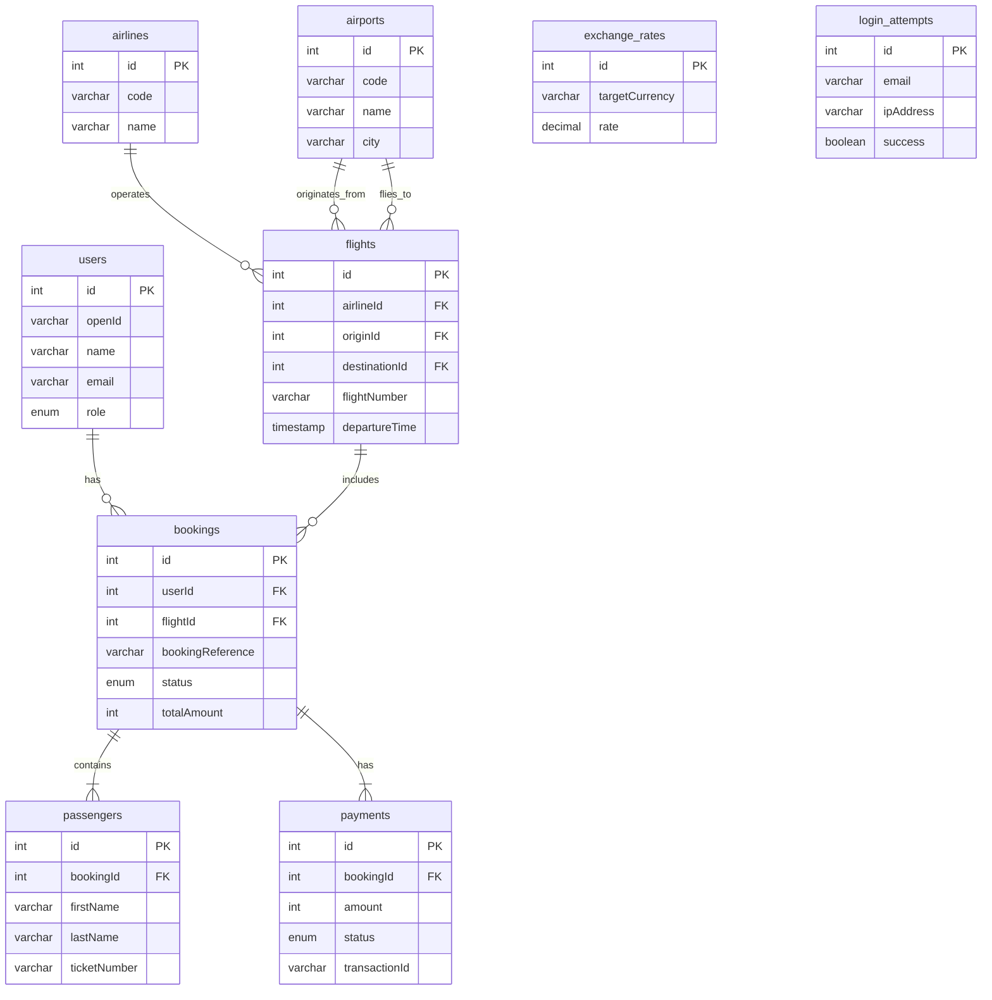

# الدليل الفني الشامل لنظام الطيران المتكامل (AIS)

**الإصدار:** 2.0  
**تاريخ التحديث:** 23 نوفمبر 2025  
**المؤلف:** Manus AI

---

## جدول المحتويات

1. [مقدمة](#1-مقدمة)
2. [البنية التقنية](#2-البنية-التقنية)
3. [قاعدة البيانات](#3-قاعدة-البيانات)
4. [الميزات المتقدمة](#4-الميزات-المتقدمة)
5. [الأمان](#5-الأمان)
6. [الأداء والتوسع](#6-الأداء-والتوسع)
7. [التثبيت والتشغيل](#7-التثبيت-والتشغيل)
8. [الاختبارات](#8-الاختبارات)
9. [النشر](#9-النشر)
10. [واجهة برمجة التطبيقات (API)](#10-واجهة-برمجة-التطبيقات-api)

---

## 1. مقدمة

### 1.1 نظرة عامة

نظام الطيران المتكامل (AIS) هو منصة شاملة ومتقدمة لإدارة وحجز تذاكر الطيران، تم بناؤها باستخدام أحدث التقنيات لتوفير حل متكامل وآمن وقابل للتوسع. يغطي النظام جميع جوانب عمليات الطيران، بدءًا من بحث المستخدم عن الرحلات، مرورًا بالحجز والدفع الآمن، وانتهاءً بإدارة الحجوزات وتسجيل الوصول.

تم تصميم النظام ليكون معياريًا، مما يسمح بإضافة ميزات جديدة وتكاملات مستقبلية بسهولة. يعتمد النظام على بنية تحتية قوية تضمن الأداء العالي والموثوقية.

### 1.2 الميزات الرئيسية

| الميزة                    | الوصف                                                                  |
| ------------------------- | ---------------------------------------------------------------------- |
| **حجز متكامل**            | نظام كامل لحجز الرحلات من البحث إلى الدفع.                             |
| **تذاكر إلكترونية**       | توليد تذاكر إلكترونية (PDF) مع رمز QR وبطاقات صعود الطائرة.            |
| **برنامج الولاء**         | نظام أميال ومكافآت متكامل مع مستويات (Bronze, Silver, Gold, Platinum). |
| **دعم متعدد العملات**     | دعم 10 عملات رئيسية مع تحويل فوري للأسعار.                             |
| **إدارة الحجوزات**        | تعديل وإلغاء الحجوزات مع حساب الرسوم تلقائيًا.                         |
| **لوحة تحكم للإدارة**     | واجهة شاملة لإدارة الرحلات، الحجوزات، والإحصائيات.                     |
| **نظام أمان متقدم**       | حماية من الهجمات، قفل الحسابات، وتسجيل شامل للأنشطة.                   |
| **واجهة عربية وإنجليزية** | دعم كامل للغتين العربية والإنجليزية.                                   |

---

## 2. البنية التقنية

### 2.1 المكدس التقني (Tech Stack)

| الطبقة               | التقنية                 | الإصدار         |
| -------------------- | ----------------------- | --------------- |
| **Backend**          | Node.js, Express, tRPC  | 22+, 4.21, 11.6 |
| **Frontend**         | React, TypeScript, Vite | 19.1, 5.9, 7.1  |
| **Database**         | MySQL/TiDB, Drizzle ORM | 8.0+, 0.44      |
| **Styling**          | Tailwind CSS, shadcn/ui | 4.1, latest     |
| **State Management** | @tanstack/react-query   | 5.90            |
| **Payment**          | Stripe SDK              | 20.0            |
| **Testing**          | Vitest, Playwright      | 2.1, latest     |
| **Logging**          | Pino                    | 10.1            |

### 2.2 المخطط المعماري

```mermaid
graph TD
    subgraph Client Layer
        A[React UI]
        B[i18n - AR/EN]
        C[PWA Support]
    end

    subgraph API Layer (tRPC)
        D[Flights API]
        E[Bookings API]
        F[Payments API]
        G[Admin API]
        H[Analytics API]
        I[Loyalty API]
        J[E-Ticket API]
        K[Currency API]
    end

    subgraph Services Layer
        L[Booking Service]
        M[Payment Service]
        N[E-Ticket Service]
        O[Loyalty Service]
        P[Inventory Lock Service]
        Q[Currency Service]
        R[Security Service]
    end

    subgraph Database Layer
        S[Drizzle ORM]
        T[MySQL / TiDB]
    end

    subgraph External Services
        U[Stripe]
        V[AWS S3]
        W[Email Service]
        X[ExchangeRate API]
    end

    Client -- tRPC --> API
    API --> Services
    Services --> Database
    Services --> External
    Database --> S & T
```

---

## 3. قاعدة البيانات

### 3.1 مخطط الكيانات والعلاقات (ERD)



### 3.2 الجداول الجديدة

| الجدول                      | الوصف                                                            |
| --------------------------- | ---------------------------------------------------------------- |
| `exchange_rates`            | يخزن أسعار صرف العملات مقابل الريال السعودي، ويتم تحديثه دوريًا. |
| `user_currency_preferences` | يحفظ العملة المفضلة لكل مستخدم.                                  |
| `login_attempts`            | يسجل جميع محاولات تسجيل الدخول (الناجحة والفاشلة) لأغراض أمنية.  |
| `account_locks`             | يخزن الحسابات المقفلة بسبب نشاط مشبوه.                           |
| `security_events`           | سجل تدقيق لجميع الأحداث الأمنية في النظام.                       |
| `ip_blacklist`              | قائمة بعناوين IP المحظورة.                                       |

---

## 4. الميزات المتقدمة

### 4.1 دعم العملات المتعددة

- **الوصف:** يمكن للمستخدمين عرض الأسعار والدفع بعملتهم المفضلة. يتم دعم 10 عملات رئيسية، مع تحديث أسعار الصرف تلقائيًا كل 24 ساعة.
- **الخدمة:** `currency.service.ts`
- **الواجهة:** `CurrencySelector.tsx`

### 4.2 التسجيل الموحد و Request ID

- **الوصف:** يتم إنشاء معرف فريد (Request ID) لكل طلب API، مما يسهل تتبع الطلبات عبر النظام. يتم استخدام نظام تسجيل موحد (Pino) مع إخفاء تلقائي للمعلومات الشخصية (PII Masking) لضمان الخصوصية.
- **الخدمة:** `unified-logger.ts`
- **Middleware:** `request-id.middleware.ts`

### 4.3 ميزات الأمان المتقدمة

- **الوصف:** تم إضافة طبقة أمان متقدمة تشمل قفل الحساب تلقائيًا بعد 5 محاولات تسجيل دخول فاشلة، وحظر عناوين IP المشبوهة، وتسجيل جميع الأحداث الأمنية.
- **الخدمة:** `account-lock.service.ts`
- **الجداول:** `login_attempts`, `account_locks`, `ip_blacklist`

---

## 5. الأمان

| الميزة               | الوصف                                                  | الحالة       |
| -------------------- | ------------------------------------------------------ | ------------ |
| **المصادقة**         | Manus OAuth                                            | ✅ مكتمل     |
| **Rate Limiting**    | حماية من هجمات DDoS على Endpoints الحرجة.              | ✅ مكتمل     |
| **أمان الكوكيز**     | استخدام `httpOnly`, `secure`, `sameSite`.              | ✅ مكتمل     |
| **صلاحيات الإدارة**  | حماية المسارات الخاصة بالمسؤولين (Admin Guards).       | ✅ مكتمل     |
| **منع التكرار**      | استخدام `Idempotency Keys` لمنع تكرار المدفوعات.       | ✅ مكتمل     |
| **التحقق من البيئة** | التحقق من متغيرات البيئة عند بدء التشغيل باستخدام Zod. | ✅ مكتمل     |
| **قفل الحساب**       | قفل الحساب تلقائيًا بعد محاولات فاشلة.                 | ✅ مكتمل     |
| **PII Masking**      | إخفاء المعلومات الحساسة في السجلات (Logs).             | ✅ مكتمل     |
| **2FA/MFA**          | المصادقة الثنائية.                                     | ❌ غير موجود |

---

## 6. الأداء والتوسع

### 6.1 تحسينات الأداء

- **فهارس قاعدة البيانات:** تم إضافة فهارس مركبة للاستعلامات الشائعة لتحسين سرعة البحث.
- **تقسيم الكود:** يتم تحميل كود كل صفحة عند الحاجة فقط.
- **التخزين المؤقت (Caching):** استخدام React Query لتخزين البيانات مؤقتًا في الواجهة الأمامية.
- **التحميل الكسول (Lazy Loading):** تحميل الصور والمكونات غير الأساسية عند الحاجة.

### 6.2 قابلية التوسع

- **قاعدة البيانات:** استخدام TiDB أو MySQL Cluster يسمح بالتوسع الأفقي لقاعدة البيانات.
- **البنية:** يمكن فصل الخدمات إلى Microservices في المستقبل.
- **التخزين المؤقت:** تم التخطيط لإضافة Redis لتخزين نتائج البحث والبيانات المتكررة.
- **موازنة التحميل (Load Balancing):** يمكن وضع النظام خلف Load Balancer لتوزيع الطلبات.

---

## 7. التثبيت والتشغيل

### المتطلبات

- Node.js 22+
- pnpm
- قاعدة بيانات MySQL أو TiDB

### الخطوات

1. **استنساخ المشروع:**

   ```bash
   git clone https://github.com/kafaat/ais-aviation-system.git
   cd ais-aviation-system
   ```

2. **تثبيت الحزم:**

   ```bash
   pnpm install
   ```

3. **إعداد البيئة:**
   - انسخ ملف `.env.example` إلى `.env`.
   - املأ متغيرات البيئة المطلوبة، خاصة `DATABASE_URL` و `STRIPE_SECRET_KEY`.

4. **تطبيق Migrations:**

   ```bash
   pnpm db:push
   ```

5. **إضافة بيانات تجريبية (اختياري):**

   ```bash
   npx tsx scripts/seed-data.mjs
   ```

6. **تشغيل المشروع:**

   ```bash
   pnpm dev
   ```

   سيعمل المشروع على `http://localhost:3000`.

---

## 8. الاختبارات

### أنواع الاختبارات

- **Unit Tests:** باستخدام Vitest لتغطية الخدمات والوظائف الأساسية.
- **Integration Tests:** للتحقق من تكامل المكونات معًا.
- **E2E Tests:** باستخدام Playwright لمحاكاة سيناريوهات المستخدم الكاملة.

### كيفية التشغيل

```bash
# تشغيل جميع الاختبارات
pnpm test

# تشغيل في وضع المراقبة
pnpm test:watch

# تشغيل اختبارات E2E
pnpm test:e2e
```

---

## 9. النشر

### المتطلبات

- خادم Node.js 22+
- قاعدة بيانات MySQL/TiDB
- متغيرات البيئة الخاصة بالإنتاج.

### خطوات النشر

1. **بناء المشروع:**

   ```bash
   pnpm build
   ```

   سيقوم هذا الأمر ببناء الواجهة الأمامية والخلفية في مجلد `dist`.

2. **تشغيل الخادم:**

   ```bash
   pnpm start
   ```

   سيقوم هذا الأمر بتشغيل الخادم في وضع الإنتاج.

3. **إعداد Reverse Proxy (موصى به):**
   - استخدم Nginx أو Caddy كـ Reverse Proxy.
   - قم بإعداد SSL/TLS (Let's Encrypt).
   - قم بتوجيه الطلبات إلى `http://localhost:3000`.

---

## 10. واجهة برمجة التطبيقات (API)

يستخدم النظام tRPC، مما يعني أن الواجهات type-safe ولا تتطلب توثيق Swagger/OpenAPI تقليدي. يمكن للعميل استدعاء الإجراءات مباشرة مع اكتمال تلقائي للأنواع.

### Routers الرئيسية

- `flights`: للبحث عن الرحلات وتفاصيلها.
- `bookings`: لإنشاء وإدارة الحجوزات.
- `payments`: لمعالجة المدفوعات والاستردادات.
- `admin`: لإدارة النظام (الرحلات، الإحصائيات، إلخ).
- `loyalty`: لبرنامج الولاء.
- `eticket`: لتوليد التذاكر الإلكترونية.
- `currency`: للعملات وأسعار الصرف.
- `security`: للأحداث الأمنية.

### مثال على استدعاء API (Client-side)

```typescript
import { trpc } from "../lib/trpc";

function FlightSearch() {
  const { data, isLoading } = trpc.flights.search.useQuery({
    originId: 1,
    destinationId: 2,
    departureDate: new Date(),
  });

  if (isLoading) return <p>Loading...</p>;

  return (
    <ul>
      {data?.map(flight => (
        <li key={flight.id}>{flight.flightNumber}</li>
      ))}
    </ul>
  );
}
```

---

**نهاية الدليل**
