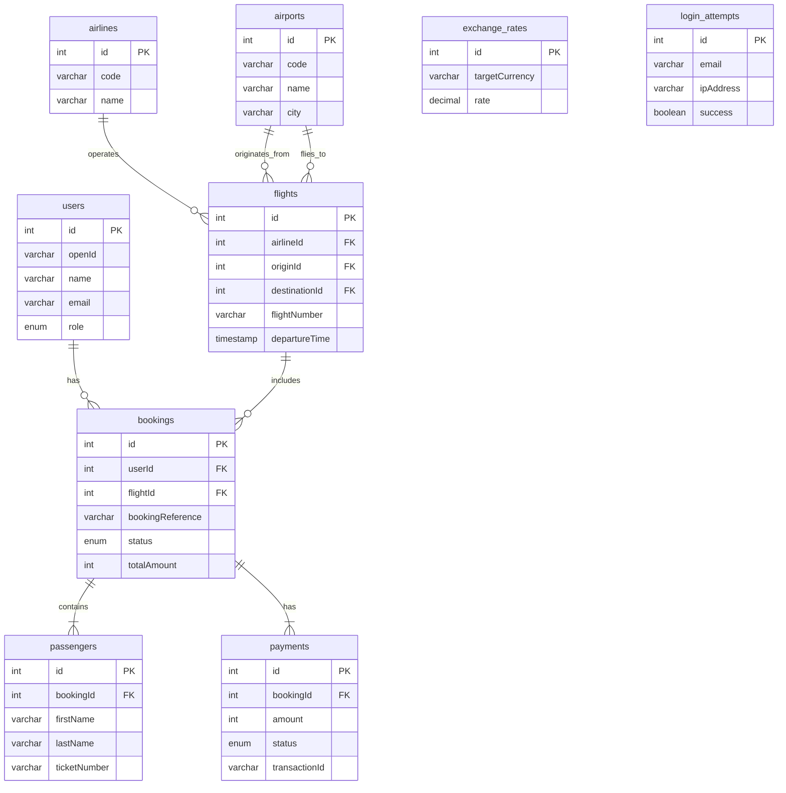

# Comprehensive Technical Guide for the Integrated Aviation System (AIS)

**Version:** 2.0  
**Last Updated:** November 23, 2025  
**Author:** Manus AI

---

## Table of Contents

1. [Introduction](#1-introduction)
2. [Technical Architecture](#2-technical-architecture)
3. [Database](#3-database)
4. [Advanced Features](#4-advanced-features)
5. [Security](#5-security)
6. [Performance & Scalability](#6-performance--scalability)
7. [Installation & Setup](#7-installation--setup)
8. [Testing](#8-testing)
9. [Deployment](#9-deployment)
10. [API](#10-api)

---

## 1. Introduction

### 1.1 Overview

The Integrated Aviation System (AIS) is a comprehensive and advanced platform for managing and booking airline tickets, built using the latest technologies to provide an integrated, secure, and scalable solution. The system covers all aspects of aviation operations, from user flight searches, through booking and secure payment, to booking management and check-in.

The system is designed to be modular, allowing for the easy addition of new features and future integrations. It relies on a robust infrastructure that ensures high performance and reliability.

### 1.2 Key Features

| Feature                    | Description                                                                         |
| -------------------------- | ----------------------------------------------------------------------------------- |
| **Integrated Booking**     | A complete system for booking flights from search to payment.                       |
| **E-Ticketing**            | Generation of e-tickets (PDF) with QR codes and boarding passes.                    |
| **Loyalty Program**        | An integrated miles and rewards system with tiers (Bronze, Silver, Gold, Platinum). |
| **Multi-Currency Support** | Support for 10 major currencies with instant price conversion.                      |
| **Booking Management**     | Modify and cancel bookings with automatic fee calculation.                          |
| **Admin Dashboard**        | A comprehensive interface for managing flights, bookings, and statistics.           |
| **Advanced Security**      | Protection against attacks, account locking, and comprehensive activity logging.    |
| **Arabic & English UI**    | Full support for both Arabic and English languages.                                 |

---

## 2. Technical Architecture

### 2.1 Tech Stack

| Layer                | Technology              | Version         |
| -------------------- | ----------------------- | --------------- |
| **Backend**          | Node.js, Express, tRPC  | 22+, 4.21, 11.6 |
| **Frontend**         | React, TypeScript, Vite | 19.1, 5.9, 7.1  |
| **Database**         | MySQL/TiDB, Drizzle ORM | 8.0+, 0.44      |
| **Styling**          | Tailwind CSS, shadcn/ui | 4.1, latest     |
| **State Management** | @tanstack/react-query   | 5.90            |
| **Payment**          | Stripe SDK              | 20.0            |
| **Testing**          | Vitest, Playwright      | 2.1, latest     |
| **Logging**          | Pino                    | 10.1            |

### 2.2 Architectural Diagram

```mermaid
graph TD
    subgraph Client Layer
        A[React UI]
        B[i18n - AR/EN]
        C[PWA Support]
    end

    subgraph API Layer (tRPC)
        D[Flights API]
        E[Bookings API]
        F[Payments API]
        G[Admin API]
        H[Analytics API]
        I[Loyalty API]
        J[E-Ticket API]
        K[Currency API]
    end

    subgraph Services Layer
        L[Booking Service]
        M[Payment Service]
        N[E-Ticket Service]
        O[Loyalty Service]
        P[Inventory Lock Service]
        Q[Currency Service]
        R[Security Service]
    end

    subgraph Database Layer
        S[Drizzle ORM]
        T[MySQL / TiDB]
    end

    subgraph External Services
        U[Stripe]
        V[AWS S3]
        W[Email Service]
        X[ExchangeRate API]
    end

    Client -- tRPC --> API
    API --> Services
    Services --> Database
    Services --> External
    Database --> S & T
```

---

## 3. Database

### 3.1 Entity-Relationship Diagram (ERD)



### 3.2 New Tables

| Table                       | Description                                                               |
| --------------------------- | ------------------------------------------------------------------------- |
| `exchange_rates`            | Stores currency exchange rates against SAR, updated periodically.         |
| `user_currency_preferences` | Saves the preferred currency for each user.                               |
| `login_attempts`            | Records all login attempts (successful and failed) for security purposes. |
| `account_locks`             | Stores accounts locked due to suspicious activity.                        |
| `security_events`           | An audit log for all security-related events in the system.               |
| `ip_blacklist`              | A list of blocked IP addresses.                                           |

---

## 4. Advanced Features

### 4.1 Multi-Currency Support

- **Description:** Users can view prices and pay in their preferred currency. 10 major currencies are supported, with exchange rates updated automatically every 24 hours.
- **Service:** `currency.service.ts`
- **UI:** `CurrencySelector.tsx`

### 4.2 Unified Logging & Request ID

- **Description:** A unique Request ID is generated for each API request, making it easy to trace requests through the system. A unified logging system (Pino) is used with automatic PII Masking to ensure privacy.
- **Service:** `unified-logger.ts`
- **Middleware:** `request-id.middleware.ts`

### 4.3 Advanced Security Features

- **Description:** An advanced security layer has been added, including automatic account locking after 5 failed login attempts, blocking of suspicious IP addresses, and logging of all security events.
- **Service:** `account-lock.service.ts`
- **Tables:** `login_attempts`, `account_locks`, `ip_blacklist`

---

## 5. Security

| Feature                    | Description                                               | Status           |
| -------------------------- | --------------------------------------------------------- | ---------------- |
| **Authentication**         | Manus OAuth                                               | ✅ Complete      |
| **Rate Limiting**          | Protection against DDoS attacks on critical endpoints.    | ✅ Complete      |
| **Cookie Security**        | Use of `httpOnly`, `secure`, `sameSite`.                  | ✅ Complete      |
| **Admin Permissions**      | Protection of admin-only routes (Admin Guards).           | ✅ Complete      |
| **Idempotency**            | Use of `Idempotency Keys` to prevent duplicate payments.  | ✅ Complete      |
| **Environment Validation** | Validation of environment variables on startup using Zod. | ✅ Complete      |
| **Account Locking**        | Automatic account locking after failed attempts.          | ✅ Complete      |
| **PII Masking**            | Masking of sensitive information in logs.                 | ✅ Complete      |
| **2FA/MFA**                | Two-Factor Authentication.                                | ❌ Not available |

---

## 6. Performance & Scalability

### 6.1 Performance Enhancements

- **Database Indexes:** Composite indexes have been added for common queries to improve search speed.
- **Code Splitting:** Each page's code is loaded only when needed.
- **Caching:** React Query is used for client-side data caching.
- **Lazy Loading:** Images and non-essential components are loaded on demand.

### 6.2 Scalability

- **Database:** Using TiDB or MySQL Cluster allows for horizontal database scaling.
- **Architecture:** Services can be separated into Microservices in the future.
- **Caching:** Redis is planned for caching search results and repetitive data.
- **Load Balancing:** The system can be placed behind a Load Balancer to distribute requests.

---

## 7. Installation & Setup

### Prerequisites

- Node.js 22+
- pnpm
- MySQL or TiDB database

### Steps

1. **Clone the project:**

   ```bash
   git clone https://github.com/kafaat/ais-aviation-system.git
   cd ais-aviation-system
   ```

2. **Install packages:**

   ```bash
   pnpm install
   ```

3. **Set up the environment:**
   - Copy `.env.example` to `.env`.
   - Fill in the required environment variables, especially `DATABASE_URL` and `STRIPE_SECRET_KEY`.

4. **Apply migrations:**

   ```bash
   pnpm db:push
   ```

5. **Seed data (optional):**

   ```bash
   npx tsx scripts/seed-data.mjs
   ```

6. **Run the project:**

   ```bash
   pnpm dev
   ```

   The project will run on `http://localhost:3000`.

---

## 8. Testing

### Test Types

- **Unit Tests:** Using Vitest to cover services and core functions.
- **Integration Tests:** To verify the integration of components.
- **E2E Tests:** Using Playwright to simulate full user scenarios.

### How to Run

```bash
# Run all tests
pnpm test

# Run in watch mode
pnpm test:watch

# Run E2E tests
pnpm test:e2e
```

---

## 9. Deployment

### Prerequisites

- Node.js 22+ server
- MySQL/TiDB database
- Production environment variables.

### Deployment Steps

1. **Build the project:**

   ```bash
   pnpm build
   ```

   This command will build the frontend and backend into the `dist` folder.

2. **Start the server:**

   ```bash
   pnpm start
   ```

   This command will run the server in production mode.

3. **Set up a Reverse Proxy (recommended):**
   - Use Nginx or Caddy as a Reverse Proxy.
   - Set up SSL/TLS (Let's Encrypt).
   - Forward requests to `http://localhost:3000`.

---

## 10. API

The system uses tRPC, which means the APIs are type-safe and do not require traditional Swagger/OpenAPI documentation. The client can call procedures directly with full type-safety and autocompletion.

### Main Routers

- `flights`: For searching flights and their details.
- `bookings`: For creating and managing bookings.
- `payments`: For processing payments and refunds.
- `admin`: For system administration (flights, statistics, etc.).
- `loyalty`: For the loyalty program.
- `eticket`: For generating e-tickets.
- `currency`: For currencies and exchange rates.
- `security`: For security events.

### Example API Call (Client-side)

```typescript
import { trpc } from "../lib/trpc";

function FlightSearch() {
  const { data, isLoading } = trpc.flights.search.useQuery({
    originId: 1,
    destinationId: 2,
    departureDate: new Date(),
  });

  if (isLoading) return <p>Loading...</p>;

  return (
    <ul>
      {data?.map(flight => (
        <li key={flight.id}>{flight.flightNumber}</li>
      ))}
    </ul>
  );
}
```

---

**End of Guide**
